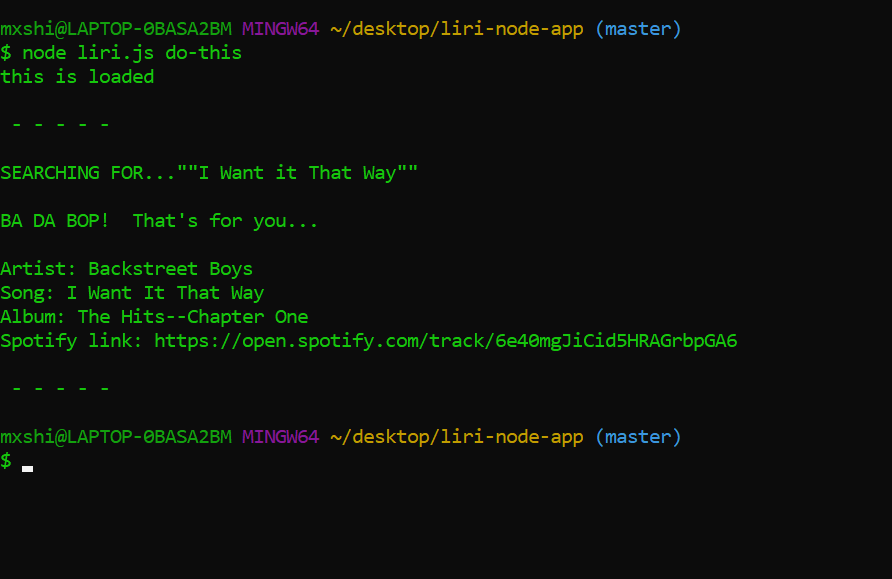

# liri-node-app


### Overview

In this assignment, you will make LIRI. LIRI is like iPhone's SIRI. However, while SIRI is a Speech Interpretation and Recognition Interface, LIRI is a _Language_ Interpretation and Recognition Interface. LIRI will be a command line node app that takes in parameters and gives you back data.

### Before You Begin

1. LIRI will display your latest tweets. As we do not want to display your personal account, or its keys, please make an alias account and add a few tweets to it!

2. Make a new GitHub repository called liri-node-app and clone it to your computer.

3. To retrieve the data that will power this app, you'll need to send requests to the axios package to the Bands in Town, Spotify and OMDB APIs. You'll find these Node packages crucial for your assignment.
   * [Spotify](https://www.npmjs.com/package/node-spotify-api)
   
   * [axios](https://www.npmjs.com/package/axios)
     
     * You'll use Request to grab data from the [OMDB API](http://www.omdbapi.com).
   * [moment](https://www.npmjs.com/package/moment)
   * [DotEnv](https://www.npmjs.com/package/DotEnv)
### Instructions

1. Initialize a `package.json` file at your project root. Be sure to save all of the npm packages you'll be using to this file. If you fail to initialize a `package.json` file and save your dependencies to it, it will be troublesome, and at times almost impossible for anyone else to run your code.

2.Make a .gitignore file and add the following lines to it. This will tell git not to track these files, and thus they won't be committed to Github.
```
node_modules
.DS_Store
```

3. Make a JavaScript file named `keys.js`. 
*Inside keys.js your file will look like this:

```
console.log('this is loaded');

exports.spotify = {
  id: process.env.SPOTIFY_ID,
  secret: process.env.SPOTIFY_SECRET
};

```

4. Next, create a file named .env, add the following to it, replacing the values with your API keys (no quotes) once you have them:

```
# Spotify API keys

SPOTIFY_ID=your-spotify-id
SPOTIFY_SECRET=your-spotify-secret

```

   * This file will be used by the `dotenv` package to set what are known as environment variables to the global `process.env` object in node. These are values that are meant to be specific to the computer that node is running on, and since we are gitignoring this file, they won't be pushed to github — keeping our API key information private.

   *If someone wanted to clone your app from github and run it themselves, they would need to supply their own `.Env` file for it to work.
   
   

5. Make a file called `random.text`.

   * Inside of `random.text` put the following in with no extra characters or white space:
     
     * spotify-this-song,"I Want it That Way"

6. Make a JavaScript file named `liri.js`.

7. At the top of the `liri.js`file,add code to read and set any environment variables with the dotenv package:
```
reuire("dotenv").config();
```
8. Add the code required to import the `keys.js` file and store it in a variable.
```
 var keys = require("./keys.js");
```

   * You should then be able to access your keys information like so
   ```
   var spotify = new Spotify(keys.spotify);
   ```
  9. Make it so liri.js can take in one of the following commands:

   * `concert-this`.
   * `spotify-this`.
   * `movie-this`.
   * `do-this`.

### What Each Command Should Do

1. `node liri.js concert-this'<artist/band name here>'`.

   * This will search the Bands in Town Artist Events API ("https://rest.bandsintown.com/artists/" + artist + "/events?app_id=codingbootcamp") for an artist and render the following information about each event to the terminal:
      * Name of the venue
      * Venue location
      * Date of the Event (use moment to format this as "MM/DD/YYYY")


2. `node liri.js spotify-this '<song name here>'`.

   * This will show the following information about the song in your terminal/bash window
     
     * Artist(s)
     
     * The song's name
     
     * A preview link of the song from Spotify
     
     * The album that the song is from


 3. `node liri.js movie-this '<movie name here>'`.

   * This will output the following information to your terminal/bash window:

     ```
       * Title of the movie.
       * Year the movie came out.
       * IMDB Rating of the movie.
       * Rotten Tomatoes Rating of the movie.
       * Country where the movie was produced.
       * Language of the movie.
       * Plot of the movie.
       * Actors in the movie.
     ```

   * If the user doesn't type a movie in, the program will output data for the movie 'Mr. Nobody.'
     
     * If you haven't watched "Mr. Nobody," then you should: <http://www.imdb.com/title/tt0485947/>
     
     * It's on Netflix!
   
   * You'll use the request package to retrieve data from the OMDB API. Like all of the in-class activities, the OMDB API requires an API key. You may use `trilogy`.

4. `node liri.js do-this`.
   
   * Using the `fs` Node package, LIRI will take the text inside of random.txt and then use it to call one of LIRI's commands.
     
     * It should run `spotify-this-song` for "I Want it That Way," as follows the text in `random.txt`.
     
     * Feel free to change the text in that document to test out the feature for other commands.
     


